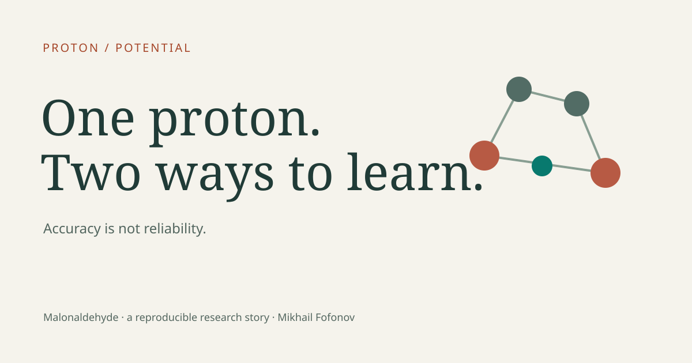
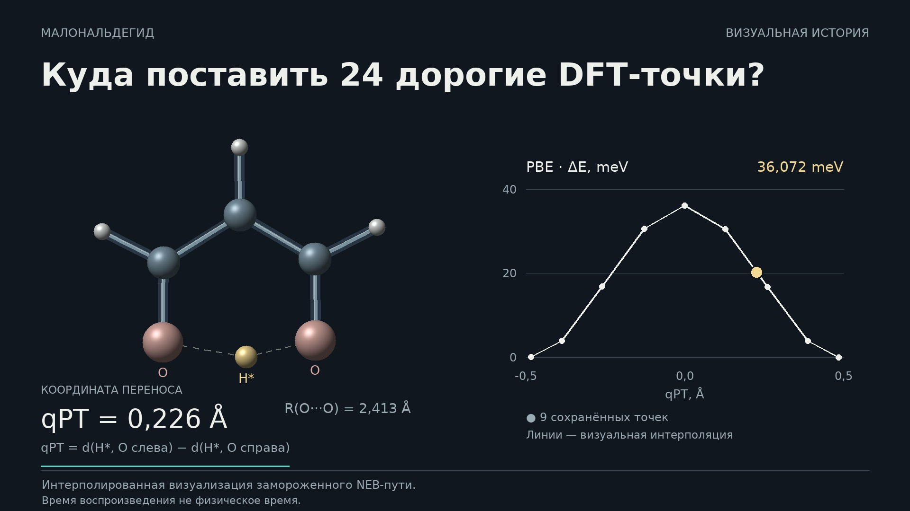

# malonaldehyde-transition-sampling

This repository records an equal-DFT-budget comparison of two Moment Tensor Potentials for proton transfer in malonaldehyde, together with the later checks that exposed important limits of the original interpretation.

## Proton / Potential — One Proton. Several Tests of Trust.

[Open the English research exhibit](https://spicmaff.github.io/malonaldehyde-transition-sampling/)

Explore an actual three-dimensional molecular stage, the changing heavy-atom
scaffold, real training-set projections, original energy profiles and their
residuals, all five paired seeds, two separate diagnostic criteria, and atom-wise
PBE/MTP force differences reconstructed from 297 primary force components.
A new English essay connects the evidence with 18 annotated research references.
Two new English 1080p/60 fps films accompany the interactive six-scene story.

The site is English-only, with light/dark themes, accessible manual controls,
Canvas and no-JavaScript fallbacks, and pinned source evidence.
`SEED_SENSITIVE` and `STATIC_APPLICABILITY_FAIL` remain unchanged.
[Rebuild the exhibit and inspect its scientific boundaries](docs/RESEARCH_SITE.md).

## Historical visual story · v1.2.0

Three new 60 fps chapters, a teaser, a vertical clip and a Russian longread in one portable HTML package. [Download the complete story with all videos](https://github.com/spicmaff/malonaldehyde-transition-sampling/releases/download/v1.2.0/MALONALDEHYDE_VISUAL_STORY_20261005_v001.zip), extract and open `index.html`. [Read the longread](presentation/visual-story/v001/text/LONGREAD_FULL.md) · [Rendering and scientific boundaries](docs/VISUAL_STORY.md). This presentation upgrade preserves the v1.1.2 science, seed sensitivity and terminal Train119 applicability FAIL.

## What the original locked artifacts show

Both v028 models used 60 DFT configurations: 36 shared configurations plus 24 branch-specific additions. For the single stochastic training realization that produced the original locked models, transition-focused placement reduced the frozen-PBE-path lower-endpoint barrier error from 35.25 to 4.10 meV and the transition-region force-component RMSE from 0.1760 to 0.0787 eV/Å.

Those numerical statements are reproducible from the compact CFG payloads included here. They describe the original locked model pair.

Training randomness is therefore an explicit limitation. These values should not be read as a seed-robust causal estimate of the sampling strategy. A post-publication five-seed paired retraining audit found that the basin-versus-targeted ordering is training-seed sensitive: targeted was better on both primary metrics in 3 of 5 paired seeds; one seed reversed both metrics, and one seed favored targeted on the barrier but basin on transition-force RMSE.

The historical five-seed execution interleaved each Audit21 evaluation with training, rather than completing all ten trainings before any evaluation. That procedural nonconformance is preserved in provenance. A later evaluation-only repair replay evaluated the same ten already-trained models only after all trainings existed; all 10 prediction CFGs were byte-identical to the historical outputs and every recomputed metric was identical. The robustness classification remains `SEED_SENSITIVE`.

## What was actually varied

The experiment is primarily about spatial allocation under equal data budget.

The transition candidate pool in v026 contained exactly 24 candidates and K was 24, so all 24 were selected. The result therefore does not demonstrate competitive MaxVol subset ranking within a larger transition candidate pool.

## Frozen PBE path and holdout boundary

The nine-image PBE NEB path was computed independently of the MTP evaluations. Its seven interior images were absent from both Train60 sets in the frozen geometry audit. The two endpoint geometries overlap the shared common36 training set. Consequently the whole NEB9 path, and Audit21 as a whole, are not fully independent holdouts.

The transition-force primary metric uses the three central images with absolute qPT <= 0.15 A and is not affected by those endpoint overlaps.

## Dynamics and applicability

The public first-update diagnostic captures six first attempted unconstrained integration updates at 100, 300 and 500 K from both minima. Exact source-oracle replay confirms that all six captured updated geometries exceeded the historical MaxVol applicability threshold.

That diagnostic did not produce a usable free MD trajectory and did not measure DFT error on those frames. Later PBE checks showed that applicability grade is not a universal scalar predictor of force error.

## Post-publication continuation

A later transition-tube program separated force accuracy from applicability coverage, introduced deterministic training and force-aware selector diagnostics, and ended with Train119.

The final frozen Train119 check did not pass static applicability: five of 228 replay configurations exceeded the fresh Train119 numerical stop. The saved Validation11 force payload is 11/11 below A2 = 0.09 eV/A, but Validation11 is not an independent holdout and its frozen pair-distance serialization guard remains formally nonconforming. No Train119 Gate1, longer deployment run, or Blind12 reveal was performed.

See docs/POST_PUBLICATION_CONTINUATION.md.

## October 2026: bounded local Train119 PBE diagnostic

A separate post-closure audit of the **unchanged** Train119 model compared saved
PBE references with selected 100 K development geometries: Crossing7 (Replay228
142–148; seven new historical PBE single points) and Challenge4 (93–96; four
reused PBE points). All eleven force-component RMSE values satisfy the inherited
per-configuration A2 = 0.09 eV/Å criterion; their maxima are 0.027965 and
0.029823 eV/Å, respectively. Five recorded gamma crossings coexist with small
**local** force errors. No universal gamma/error calibration is implied.

On the development Audit21, Train119's saved-path lower-endpoint barrier error
is 0.122996 meV and central-three-image force-component RMSE is 0.013834 eV/Å.
Both NEB endpoints geometrically overlap training configurations under the
previously established comparison tolerance, so these are **not independent
holdout metrics**. The barrier error is not a uniform profile-error bound.
The historical `STATIC_APPLICABILITY_FAIL`, serialization nonconformance and
`SEED_SENSITIVE` finding for the original comparison remain unchanged.

[Full local diagnostic, precise caveats and data](docs/TRAIN119_LOCAL_DIAGNOSTIC.md)
· [Corrections and geometric dependencies](docs/TRAIN119_CORRECTIONS.md)

Reproduce all saved numerical comparisons without QE or MLIP:

    python3 tools/verify_train119_diagnostic.py --data data/post_publication/train119_diagnostic_v001

No Train119 Gate1, independent deployment validation, or Blind12 reveal was performed.

## Current provenance authority

Canonical ledger V005 corrects seven source-interpretation classes and 21 authority bindings, while retaining historical ledgers and all genuine scientific FAILs. See [ledger reconciliation](docs/LEDGER_RECONCILIATION.md) and [the current pointer](provenance/CURRENT_CANONICAL_LEDGER.json). This documentation repair does not change the model results.

## Clean-clone verification

A clean clone can now:

- verify repository, script, data and public-asset manifests;
- independently recompute the original v030r barrier and force metrics from saved v029 reference/prediction CFGs;
- reproduce the two known NEB endpoint geometry overlaps;
- validate the publication figure, table, video and quantum inputs from repo-local compact source data;
- rerender publication figures and tables with the declared Python dependencies;
- inspect the post-publication RNG robustness, its evaluation-order repair, and the Train119 closure data.

Run:

    python3 tools/run_public_selftests.py .
    python3 tools/recompute_primary_metrics.py

For plotting and quantum reproduction, create the declared environment and use the scripts under reproduce/.

## Reproducibility boundary

Full DFT and model-training recomputation is not containerized in this repository. Quantum ESPRESSO, MLIP and LAMMPS/MLIP are external scientific programs; pseudopotential binaries are not redistributed. Exact software identifiers and hashes from the project are documented in docs/SOFTWARE_PROVENANCE.md.

The included trained models and compact CFG data allow substantially more verification than the original v1.0.0 release without publishing the approximately 80 GB private calculation tree.

## Scientific scope

PBE is an internal computational reference, not experimental ground truth. The H/D calculation is a frozen-path one-dimensional spectral diagnostic, not a reaction-rate calculation or full-dimensional quantum dynamics. MaxVol grade is an applicability/coverage diagnostic, not a DFT-error bar.

## Repository map

- data/publication_source_v005: sanitized compact source package used by final renderers.
- data/frozen_models_v028: original Train60 sets, templates, models, Audit21 labels and predictions.
- data/robustness: post-publication fixed-seed training-randomness audit.
- data/post_publication: compact final scientific status.
- scripts: frozen scientific, audit and publication scripts.
- provenance: public manifests and the sanitized canonical ledger.
- docs: methods, limitations, software provenance and execution boundaries.

## References

Shapeev 2016, Moment Tensor Potentials.
Podryabinkin and Shapeev 2017, active learning for linearly parametrized interatomic potentials.
Henkelman, Uberuaga and Jonsson 2000, climbing-image NEB.

Code is MIT licensed. Project-owned compact data and media are CC BY 4.0 unless a file states otherwise.
